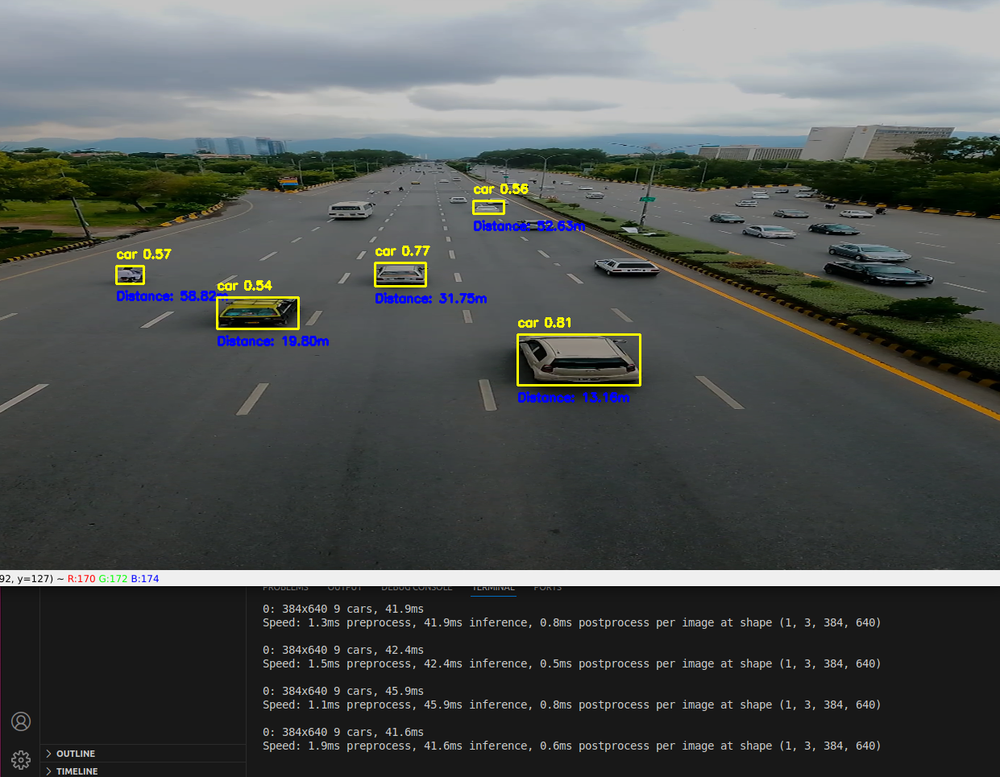
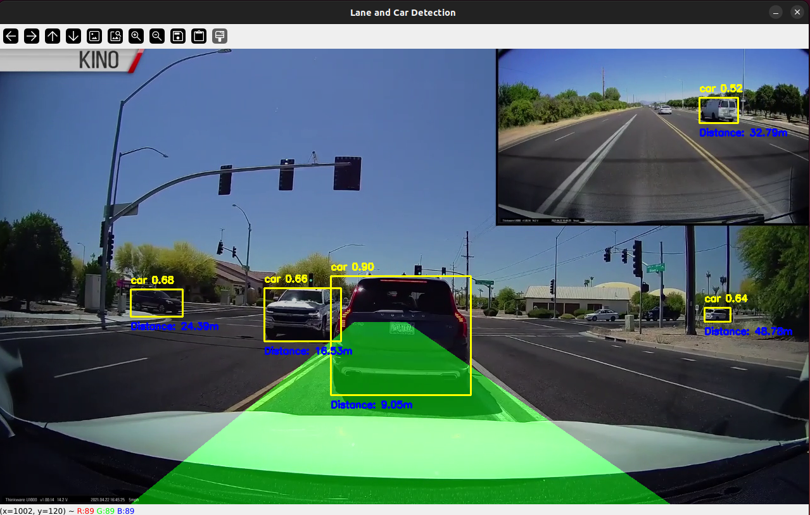
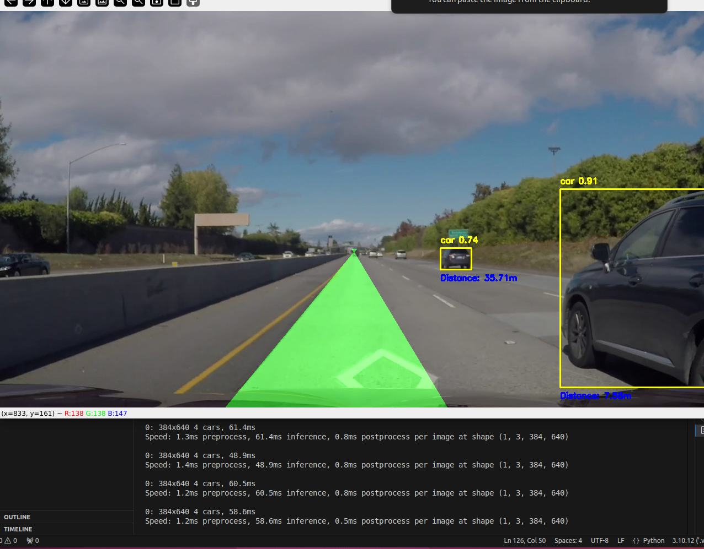

# IntelliDrive: Lane and Vehicle Detection 🏎️


---

## Introduction 🌟
This project, **IntelliDrive**, implements advanced lane and vehicle detection using the state-of-the-art YOLOv8 (You Only Look Once, version 8) model. The primary goal is to identify vehicles and lane boundaries in video data, essential for autonomous driving applications. The YOLOv8 model, with its pretrained weights, enables high accuracy and computational efficiency, making it suitable for real-time perception tasks.

---

## Highlights 🌈

- **YOLOv8**: Utilized for vehicle detection with pretrained weights. 🛠️
- **Lane Detection**: Pipeline to identify and visualize lane boundaries using edge detection and line fitting. 🛣️
- **Distance Estimation**: Approximate distances of vehicles from the camera using bounding box dimensions. 📏
- **Real-Time Processing**: Handles video data at a target frame rate of 30 FPS. 🕒
- **Autonomous Driving Applications**: Supports lane-keeping and collision avoidance perception systems. 🏎️

---

## Methodology 🔬

### 1. **Lane Detection** 🛣️
- **Edge Detection**: Applied Canny edge detection to identify edges in the video frame. ✂️
- **Region of Interest (ROI)**: Masked the area of interest to focus on lanes. 🎯
- **Line Fitting**: Hough Line Transformation and polynomial fitting were used to detect left and right lane boundaries. 📊
- **Visualization**: Created a filled polygon between lane lines for better visualization. 🖌️

#### Step 1: Masking the Region of Interest (ROI)
Only the lower part of the image (where lanes are typically visible) is processed.  
```python
def region_of_interest(img, vertices):
    mask = np.zeros_like(img)
    match_mask_color = 255
    cv2.fillPoly(mask, vertices, match_mask_color)
    masked_image = cv2.bitwise_and(img, mask)
    return masked_image
```
#### Step 2: Edge Detection using Canny
We convert the image to grayscale and apply Canny Edge Detection to highlight the edges.
```python
gray_image = cv2.cvtColor(image, cv2.COLOR_RGB2GRAY)
cannyed_image = cv2.Canny(gray_image, 100, 200)
```
#### Step 3: Hough Line Transformation
This technique detects line segments representing the lanes.
```python
lines = cv2.HoughLinesP(
    cropped_image,
    rho=6,
    theta=np.pi / 60,
    threshold=160,
    lines=np.array([]),
    minLineLength=40,
    maxLineGap=25
)
```

### 2. **Vehicle Detection** 🏎️
- **YOLOv8 Model**: Leveraged pretrained YOLOv8 weights to detect vehicles. 🧑‍💻
- **Bounding Boxes**: Drew bounding boxes around detected vehicles. 🔲
- **Classification**: Focused on detecting cars with confidence scores ≥ 0.5. ✅

#### Step 1: Load the YOLOv8 Model
We use a pre-trained YOLOv8 model to detect cars in each frame.
```python
from ultralytics import YOLO
model = YOLO('weights/yolov8n.pt')
```
#### Step 2: Draw Bounding Boxes
For each detected car, we draw bounding boxes and display the class name (car) with a confidence score.
```python
for box in boxes:
    x1, y1, x2, y2 = map(int, box.xyxy[0])
    conf = box.conf[0]
    if model.names[cls] == 'car' and conf >= 0.5:
        label = f'{model.names[cls]} {conf:.2f}'
        cv2.rectangle(lane_frame, (x1, y1), (x2, y2), (0, 255, 255), 2)
        cv2.putText(lane_frame, label, (x1, y1 - 10), cv2.FONT_HERSHEY_SIMPLEX, 0.5, (0, 255, 255), 2)
```

### 3. **Distance Estimation** 📏
- **Bounding Box Dimensions**: Used box size to estimate vehicle distance. 📐
- **Basic Calculation**: Assumed focal length and known dimensions for approximate distance calculation. 🔢

```python
def estimate_distance(bbox_width, bbox_height):
    focal_length = 1000  # Example focal length
    known_width = 2.0  # Approximate width of a car (in meters)
    distance = (known_width * focal_length) / bbox_width
    return distance
```

### 4. Video Processing Pipeline
We combine lane detection, car detection, and distance estimation into a real-time video processing pipeline.
```python
while cap.isOpened():
    ret, frame = cap.read()
    if not ret:
        break
    lane_frame = pipeline(resized_frame)
    results = model(resized_frame)
    for result in results:
        # Draw bounding boxes and estimate distance
    cv2.imshow('Lane and Car Detection', lane_frame)
    if cv2.waitKey(1) & 0xFF == ord('q'):
        break
```
### 5. **Integration** 🌐
- Combined lane detection and vehicle detection outputs for simultaneous visualization in real time. ⚡
- Enabled autonomous driving features like lane-keeping and collision avoidance. 🏎️

---

## Results 📈

The YOLOv8 model successfully detected vehicles and lane boundaries in real-world video data. The system maintained high accuracy and processing speed, even in dynamic environments. Below are the key results:

- **Vehicle Detection Accuracy**: High precision for vehicle classification. 🎯
- **Lane Detection**: Accurate identification of lane boundaries. 📊
- **Real-Time Processing**: Achieved target frame rate of 30 FPS. 🕒

### Rsults Demo 

#### Vehicle Detection Example

#### Vehicle and Lane Detection Example 1

#### Vehicle and Lane Detection Example 2


---

## Files and Directory Structure 📂

```
IntelliDrive/
|-- weights/
|   |-- yolov8n.pt               # Pretrained YOLOv8 model weights
|-- video/
|   |-- car.mp4                  # Test video for detection
|   |-- V2.mp4                   # Another test video
|   |-- challenge_video.mp4      # Test video for lane and vehicle detection
|-- lane_vehicle_detection.py    # Main script for detection
|-- README.md                    # Project documentation
|-- requirements.txt             # Dependencies for the project
```
---

## How to Use 🛠️

### 1. **Clone the Repository**
```
git clone https://github.com/ahtisham73/IntelliDrive-Lane-and-Vehicle-Detection.git
cd IntelliDrive-Lane-and-Vehicle-Detection

```
### 2. **Install Dependencies**
```
pip install -r requirements.txt
```
### 3. **Run the Detection**
```
python video.py
```
This will process the test videos inside the video/ folder.

---

## License 📜
This project is licensed under the MIT License - see the LICENSE file for details. 📜


## Acknowledgements 🙌
- Ultralytics YOLOv8 🙌
- OpenCV 🔍
  
---

🚀 Contributions are welcome! 
Submit a PR or open an issue to collaborate. Let’s build smarter

---
## 📨 Contact

You can reach me via email at [ahtishamsudheer@gmail.com](mailto:ahtishamsudheer@gmail.com).

